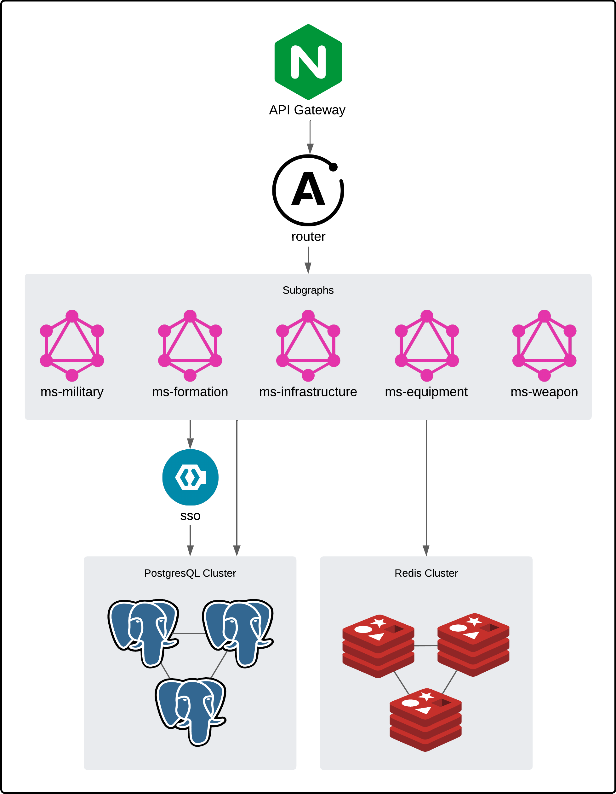

# Military District

<p align="center">
   <a href="https://github.com/ptrvsrg/military-district-backend/graphs/contributors">
        
   </a>
   <a href="https://github.com/ptrvsrg/military-district-backend/forks">
        
   </a>
   <a href="https://github.com/ptrvsrg/military-district-backend/stargazers">
        
   </a>
   <a href="https://github.com/ptrvsrg/military-district-backend/issues">
        
   </a>
   <a href="https://github.com/ptrvsrg/military-district-backend/pulls">
        
   </a>
</p>

Military District - информационная система военного округа. Данная система содержит данные о дислокации военных частей,
воинской и офицерской структуре, воинских формированиях, военной технике и оружии.

## Технологии

+ Java 17
+ Spring Boot 3
+ Apollo Federation 2.3.5
+ Keycloak 24.0
+ PostgreSQL 16
+ Liquibase 4.27
+ Redis 7.2.4
+ Nginx 3.18
+ Prometheus v2.51.1
+ Grafana 10.3.4
+ PGAdmin4 8.5
+ Redis Commander

## Архитектура



Prometheus и Grafana используются для получения и отображения метрик API шлюза, роутера и микросервисов-подграфов.

PGAdmin4 позволяет следить за метриками кластера PostgreSQL, а также просматривать и модифицировать БД.

Redis Commander - простой и легковесный инструмент для управления хостами Redis

## Доступные команды 

```shell
make clean                                    # Clean generated files
make build                                    # Build the JAR files
make build-images IMAGE_PREFIX=<image prefix> # Build the Docker images
make env                                      # Create template .env file
make deploy                                   # Deploy to Docker
make help                                     # Display this message
```

## Запуск

1) Выполните команду `make env` и запомните значения переменных среды в сгенерированном файле `.env` (Опционально, в `docker-compose.yml` установлены значения по умолчанию)
2) Выполните команду `make deploy` и дождитесь загрузки необходимых образов, запуска контейнеров и окончания проверок здоровья.

## Вклад в проект

Если вы хотите внести свой вклад в проект, вы можете следовать этим шагам:

1. Создайте форк этого репозитория.
2. Внесите необходимые изменения.
3. Создайте pull request, описывая ваши изменения.