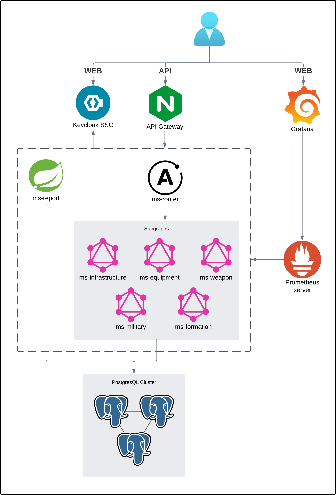

# Military District (Backend)

    

Military District - информационная система военного округа. Данная система содержит данные о дислокации военных частей,
воинской и офицерской структуре, воинских формированиях, военной технике и оружии.

## Технологии

+ Java 17
+ Spring Boot 3
+ Apollo Federation 2.3.5
+ Keycloak 24.0
+ PostgreSQL 16
+ Liquibase 4.27
+ Nginx 3.18
+ Prometheus v2.51.1
+ Grafana 10.3.4
+ PGAdmin4 8.5

## Архитектура



+ Для базовых CRUD-операций реализованы 5 микросервисов-подграфов при помощи Apollo Federation. Роутер Apollo Router
используется для разложения Graphql-запросов и проксирования.

+ Микросервис отчетов отвечает за сборку данных сложных параметризованных SQL-запросов.

+ Доступ к микросервисам осуществляется через API шлюз.

+ Keycloak выступает в роли SSO-сервера и сервера авторизации в протоколе OAuth2.0. Он необходим для хранения информации о
пользователях, их правах в системе, а также за выдачу и валидацию разного рода токенов.

+ Prometheus и Grafana используются для получения и отображения метрик API шлюза, роутера, SSO-сервера и микросервисов.

+ PGAdmin4 позволяет следить за метриками кластера PostgreSQL, а также просматривать и модифицировать БД.

## GraphQL схема

Для просмотра GraphQL схема сгенерируйте файл `supergraph.graphqls` при помощи команды:

```bash
make supergraph
```

## Запуск в режиме Development

1) Создайте файл `.env.development` и запомните значениями переменных среды (Опционально, в [`docker-compose-dev.yml`](docker-compose-dev.yml) установлены значения по умолчанию):

```bash
make dev-env
nano .env.development
```

2) Выполните команду для сборки и загрузки необходимых образов и запуска контейнеров:

```bash
make dev-up
```

3) Для остановки и удаления контейнеров выполните команду:

```bash
make dev-down
```

## Запуск в режиме Production

1) Создайте файл `.env` и запомните значениями переменных среды (Опционально, в [`docker-compose.yml`](docker-compose.yml) установлены значения по умолчанию):

```bash
make env
nano .env
```

2) Выполните команду для сборки и загрузки необходимых образов и запуска контейнеров:

```bash
make up
```

3) Для остановки и удаления контейнеров выполните команду:

```bash
make down
```

## Вклад в проект

Если вы хотите внести свой вклад в проект, вы можете следовать этим шагам:

1. Создайте форк этого репозитория.
2. Внесите необходимые изменения.
3. Создайте pull request, описывая ваши изменения.